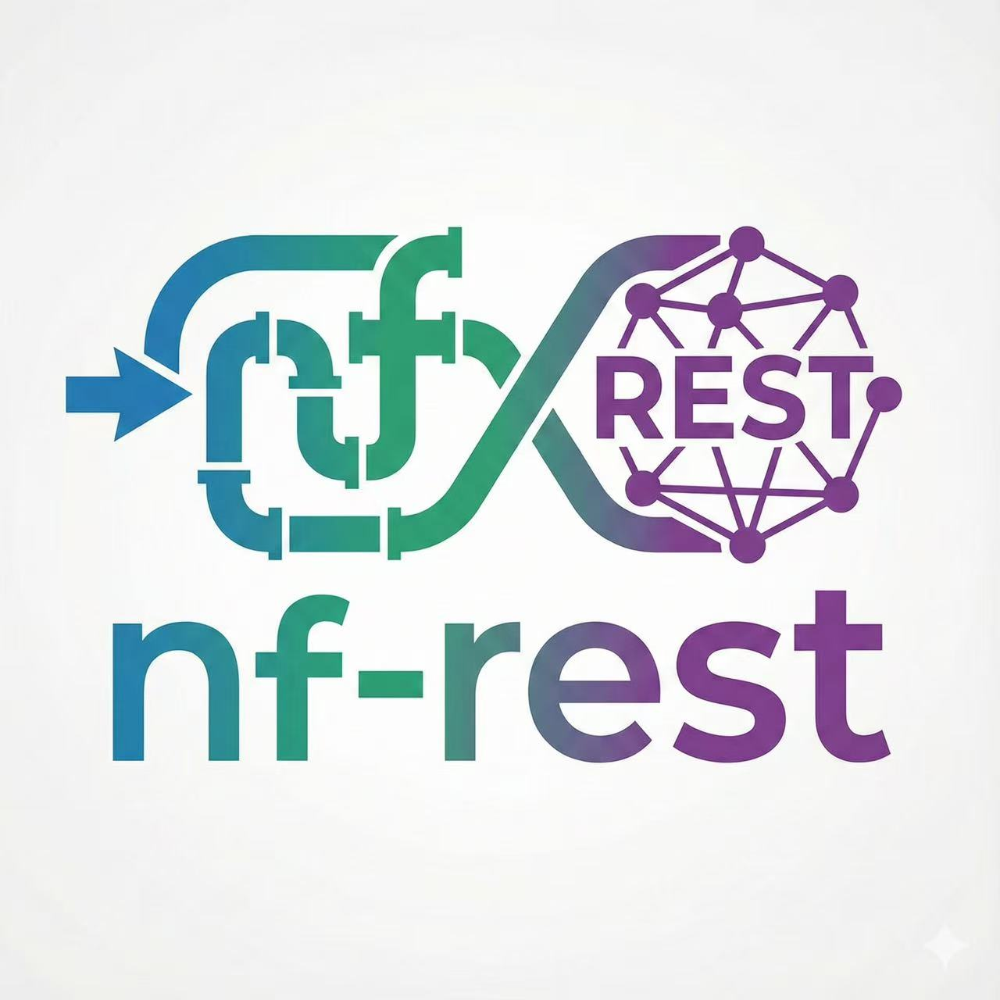

# nf-server Deployment

Deploy the Nextflow REST executor with Docker Compose, using OCI credentials and optional bastion access for private subnets. Supports S3 input staging, accelerator-aware scheduling, job locking, and prebuilt image deployment to Kubernetes.

<p align="center">
  
</p>

<p align="center">
  <a href="https://www.youtube.com/watch?v=yhLFBJLs_zc" target="_blank">
    
  </a>
</p>


## Architecture
Gateway fronts the API/queue; proxies are worker agents that provision, monitor, and health-check jobs. Proxies can run in different compartments/subnets; if you run multiple proxies, they must share the same `/opt/bot` working directory (e.g., shared volume) to keep staging/state consistent.

```
        +------------+        enqueue jobs        +-----------+
        |  Nextflow  | --------------------------> | Gateway   |
        |  REST exec |                             | (API/DB)  |
        +------------+                             +-----------+
                                                    |   |   |
                                     dispatch jobs   |   |   |
                                                    v   v   v
                                           +--------------------+
                                           |  Proxy (worker)    |
                                           |  /opt/bot shared   |
                                           +--------------------+
                                                    | provision/monitor
                                                    v
                                            +-----------------+
                                            | Runner:         |
                                            | OCI VM / BM     |
                                            | VM GPU / BM GPU |
                                            | RDMA (coming)   |
                                            +-----------------+
```

## Prerequisites
- Docker and Docker Compose plugin installed.
- OCI credentials in `./.oci` (mounted read-only):
  - `config` with your tenancy/user details.
  - Private key named `key.pem` (path defaults to `/root/.oci/key.pem`).
  - (Optional) Bastion private key named `bastion_private_key` if your worker subnet is private.
- Ability to set OCI compartment and subnet OCIDs.

## Configure environment
1. From the repo root, copy the sample env file and edit values:
   ```bash
   cp env.sample .env
   ```
2. Key settings (all referenced by `docker-compose.yml`):
  - Service tuning: `UVICORN_WORKERS`, `EXECUTOR_WORKERS`, `RUN_LOCAL`.
  - API authentication: `API_KEYS` accepts a comma-separated list for multi-tenant keys (e.g., `aaa,bbbb,xxxx,cccc,ddd`).
  - Database (MySQL 8 sidecar): `MYSQL_ROOT_PASSWORD`, `MYSQL_DATABASE`, `MYSQL_USER`, `MYSQL_PASSWORD`, plus `DB_HOST=mysql`, `DB_PORT=3306`, `DB_USER`, `DB_PASSWORD`, `DB_NAME`.
  - OCI network: `COMPARTMENT_ID`, `SUBNET_ID`.
  - Bastion (only for private subnets): `BASTION_IP`, `BASTION_USER`, `BASTION_SSH_KEY` (defaults to `/root/.oci/bastion_private_key`).
  - Compute defaults used when pipelines omit resources: `DEFAULT_SHAPE`, `DEFAULT_OCPU`, `DEFAULT_MEMORY_IN_GB`, `DEFAULT_BOOTDISK_IN_GB`.
  - Job control and staging: `DB_INIT_*` for retries, S3 credentials for input/output staging, job lock enabled by default.
   - DB init retry behavior: `DB_INIT_RETRIES`, `DB_INIT_DELAY`.

## Compose file expectations
- Volumes (defaults in `docker-compose.yml`; adjust paths as needed):
  ```yml
  - ./.oci:/root/.oci:ro          # OCI config and keys
  - /tmp/bottmp:/opt/bot          # Shared proxy workdir (all proxies must share)
  - /tmp/mysql-data:/var/lib/mysql # MySQL persistence
  ```
- Environment variables under `gateway` and `proxy-*` come from `.env`.

## Start the stack
```bash
docker compose up -d --build
docker compose logs -f rest-executor-0
```
The REST executor listens on port `7011` (mapped to container `8080`).

## Local run test
Use `LOCAL_RUN` to bypass Terraform when validating workflows locally. When `LOCAL_RUN=0` (default), the gateway skips launching Terraform and instead runs the workflow with a local bash invocation.

## Kubernetes (prebuilt image)
- Build or pull the prebuilt image and point your Kubernetes manifests to it.
- Mount OCI and S3 credentials as secrets or volumes; ensure the same env vars used in `.env` are set on the Deployment.
- For multi-node scaling, set replicas or use an HPA; the service is stateless aside from MySQL.
- Gateway/Proxy manifests live in `deploy/nf-core.yml` (gateway, MySQL) and `deploy/nf-proxy.yml` (proxy with RWX PVC). Ensure the `nf-proxy-shared-bot` PVC points to an RWX storage class (e.g., NFS/EFS) so all proxies share `/opt/bot`.

## Tools
Helper scripts are under `tools/`:
- `tools/oci_watch.sh`: monitor OCI instance status for running jobs.
- `tools/oci_kill.sh`: force-terminate an OCI instance if cleanup failed.

## Bastion guidance
Use a bastion only when worker nodes sit in a private subnet.
- Required env vars: `BASTION_IP`, `BASTION_USER`, `BASTION_SSH_KEY` (default `/root/.oci/bastion_private_key`).
- Place the bastion private key in `./.oci/bastion_private_key` (separate from your OCI API key `key.pem`).
- Ensure the bastion allows SSH from this host and can reach the target subnet.

## Default compute settings
When a pipeline does not specify resources, the gateway falls back to the defaults you set in `.env`:
- `DEFAULT_SHAPE`
- `DEFAULT_OCPU`
- `DEFAULT_MEMORY_IN_GB`
- `DEFAULT_BOOTDISK_IN_GB`

Verify quota for the chosen shape (e.g., `VM.Standard.E5.Flex`) in your target compartment.

## Multi-tenant API keys
Authenticate requests with the comma-separated `API_KEYS` list (e.g., `aaa,bbbb,xxxx,cccc,ddd`). Each key represents a tenant; rotate or add keys by updating `.env` and restarting the stack.

## Accelerator shapes
When you need GPUs or bare metal, declare accelerators in your Nextflow process and the gateway will select an appropriate shape (disk settings still apply). Example (`main.nf`):
```groovy
process A {
    cpus 1
    memory '1 GB'
    accelerator 1, type: 'VM.GPU.A10.1'

    input:
    val x

    output:
    path "a_${x}.txt"

    script:
    """
    echo "A got: ${x}" > a_${x}.txt
    """
}
```
Notes:
- `accelerator 0` keeps the job on the default (non-accelerated) shape; `accelerator 1` or higher signals the gateway to pick an accelerator-capable shape.
- GPU count is encoded in the type suffix (e.g., `VM.GPU.A10.1` = one A10 GPU, `VM.GPU.A10.4` = four A10 GPUs).
- Job lock prevents duplicate execution of the same job_id when retrying or reapplying.
- Inputs are staged from S3 when provided as `s3://...` URIs; outputs are synced back to `params.outdir`.

## RDMA and clustering support
This release targets batch workloads with dynamic, transparent pay-as-you-go scaling; RDMA is not supported yet. RDMA enablement is planned for the next release.
